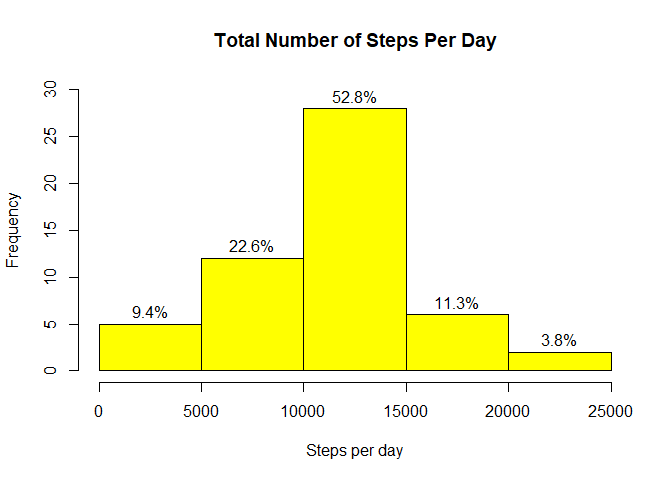
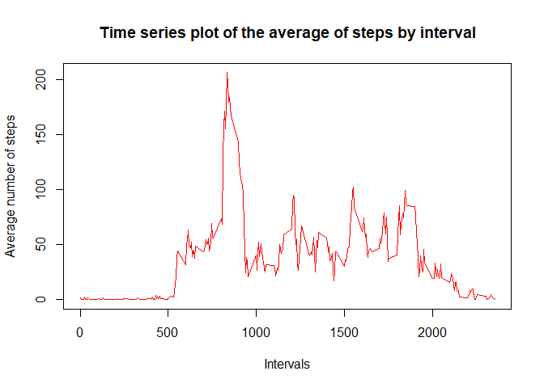
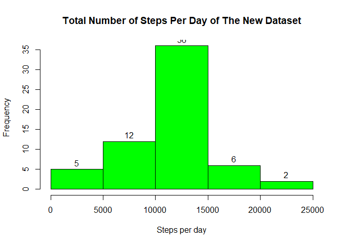
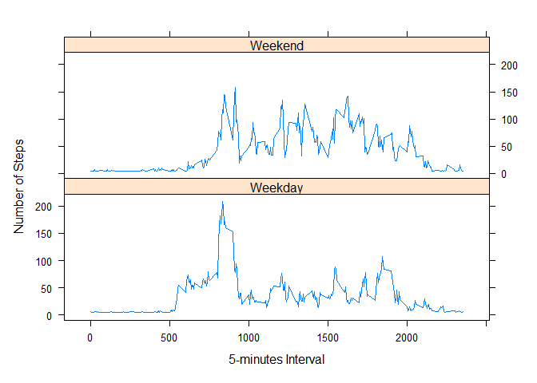

## Loading and preprocessing the data
The code assumes the zip file is already in the working directory

```r
file <-unzip("activity.zip")
data0 <- read.csv(file)
summary(data0)
```

```
##      steps            date              interval     
##  Min.   :  0.00   Length:17568       Min.   :   0.0  
##  1st Qu.:  0.00   Class :character   1st Qu.: 588.8  
##  Median :  0.00   Mode  :character   Median :1177.5  
##  Mean   : 37.38                      Mean   :1177.5  
##  3rd Qu.: 12.00                      3rd Qu.:1766.2  
##  Max.   :806.00                      Max.   :2355.0  
##  NA's   :2304
```

## What is mean total number of steps taken per day?
Table of the sum of steps per day

```r
total_steps_day1 <- aggregate(steps~date, data = data0, FUN = sum, na.rm=TRUE)
head(total_steps_day1)
```

```
##         date steps
## 1 2012-10-02   126
## 2 2012-10-03 11352
## 3 2012-10-04 12116
## 4 2012-10-05 13294
## 5 2012-10-06 15420
## 6 2012-10-07 11015
```

Plot of the sum of steps per day

```r
b <- total_steps_day1$steps
hist(b, labels = paste0(round(hist(b,plot =FALSE)$counts/length(b)*100,1),"%"),
     col = "yellow", xlab = "Steps per day", ylim = c(0,30),
     main = "Total Number of Steps Per Day")
```

<!-- -->

Mean and Median of the sum of steps per day

```r
mean(total_steps_day1$steps)
```

```
## [1] 10766.19
```

```r
median(total_steps_day1$steps)
```

```
## [1] 10765
```

## What is the average daily activity pattern?
Table of average of steps by interval

```r
avg_steps_interval <- aggregate(steps~interval, data0, FUN = mean, na.rm=TRUE)
head(avg_steps_interval)
```

```
##   interval     steps
## 1        0 1.7169811
## 2        5 0.3396226
## 3       10 0.1320755
## 4       15 0.1509434
## 5       20 0.0754717
## 6       25 2.0943396
```

Time series plot of the average of steps by interval

```r
plot(avg_steps_interval$steps~avg_steps_interval$interval, type="l",
     xlab="Intervals", ylab = "Average number of steps", 
     main="Time series plot of the average of steps by interval", col="red")
```

<!-- -->

Maximum average number of steps by 5-minute interval

```r
avg_steps_interval$interval[which.max(avg_steps_interval$steps)]
```

```
## [1] 835
```
## Imputing missing values
Sum of NAs

```r
sum(is.na(data0))
```

```
## [1] 2304
```
Replace Nas with average total steps to get a new dataset

```r
data0$steps[is.na(data0$steps)==T]<-mean(data0$steps, na.rm = TRUE) 
```
Rename the new dataset with replaced NAs

```r
data1 <-data0
head(data1)
```

```
##     steps       date interval
## 1 37.3826 2012-10-01        0
## 2 37.3826 2012-10-01        5
## 3 37.3826 2012-10-01       10
## 4 37.3826 2012-10-01       15
## 5 37.3826 2012-10-01       20
## 6 37.3826 2012-10-01       25
```
Table showing the sum of total steps by date of the new dataset

```r
total_steps_day2 <-aggregate(steps~date, data1, FUN = sum)
head(total_steps_day2)
```

```
##         date    steps
## 1 2012-10-01 10766.19
## 2 2012-10-02   126.00
## 3 2012-10-03 11352.00
## 4 2012-10-04 12116.00
## 5 2012-10-05 13294.00
## 6 2012-10-06 15420.00
```
Histogram showing the sum of total steps by date of the new dataset

```r
hist(total_steps_day2$steps, labels = TRUE, xlab = "Steps per day", 
     main = "Total Number of Steps Per Day of The New Dataset", col="green")
```

<!-- -->

Mean and media of the total steps by date of the new dataset

```r
mean(total_steps_day2$steps)
```

```
## [1] 10766.19
```

```r
median(total_steps_day2$steps)
```

```
## [1] 10766.19
```

## Are there differences in activity patterns between weekdays and weekends?
Create a function to group days into weekday or weekend

```r
wkday_fun <- function(z) {
        wd <- weekdays(as.Date(z, '%Y-%m-%d'))
        if  (!(wd == 'Saturday' || wd == 'Sunday')) {
                x <- 'Weekday'
        } 
        else {
                x <- 'Weekend'
        }
        x
}
```

Factoring Weekday verses Weekend

```r
data1$weekday <- weekdays(as.Date(data1$date))
data1$week_type <- as.factor(sapply(data1$date, wkday_fun))
levels(data1$week_type)
```

```
## [1] "Weekday" "Weekend"
```

```r
head(data1)
```

```
##     steps       date interval weekday week_type
## 1 37.3826 2012-10-01        0  Monday   Weekday
## 2 37.3826 2012-10-01        5  Monday   Weekday
## 3 37.3826 2012-10-01       10  Monday   Weekday
## 4 37.3826 2012-10-01       15  Monday   Weekday
## 5 37.3826 2012-10-01       20  Monday   Weekday
## 6 37.3826 2012-10-01       25  Monday   Weekday
```

Average of total steps by interval for weekday and weekend

```r
average_by_weektype <- aggregate(steps~interval+week_type, data1, FUN=mean)
head(average_by_weektype)
```

```
##   interval week_type    steps
## 1        0   Weekday 7.006569
## 2        5   Weekday 5.384347
## 3       10   Weekday 5.139902
## 4       15   Weekday 5.162124
## 5       20   Weekday 5.073235
## 6       25   Weekday 6.295458
```

load lattice library

```r
library(lattice)
y <- average_by_weektype$steps
x <- average_by_weektype$interval
f <- average_by_weektype$week_type
```

Plot with lattice, the Average of total steps by interval for weekday/weekend


```r
xyplot(y~x|f, layout=c(1,2), type="l", xlab = "5-minutes Interval", 
       ylab = "Number of Steps")
```

<!-- -->
